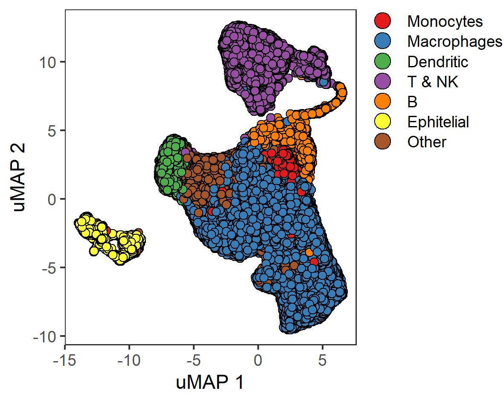

# Immune Landscape of COVID-19 Patients


## Data Pre-processing and Clustering
We used the markdown provided by Seurat R v. 3.1.5 package, the script to do so is named Seurat.R.

<details>
<summary>Data preprocessing, filtering and clustering</summary>

``` R
## Loading Data
MyData.1 <- readRDS(file = "./Data/MyDataCovid.rds")

## Identification of mitochondrial genes
MyData.1[["percent.mt"]] <- PercentageFeatureSet(MyData.1, pattern = "^MT-")
MyData.1 <- subset(MyData.1, percent.mt < 5)

balf <- SplitObject(MyData.1, split.by = "orgn")
####### Pre-processing, normalization and identification of highly variable features
balf.list <- lapply(X = balf, FUN = function(x) {
 x <- NormalizeData(x, normalization.method = "LogNormalize",scale.factor = 10000)
 x <- FindVariableFeatures(x, selection.method = "vst", nfeatures = 2000)
})

balf.anchors <- FindIntegrationAnchors( object.list = balf.list)
rm(balf.list,balf)
balf.combined <- IntegrateData(anchorset = balf.anchors)
rm(balf.anchors)
DefaultAssay(balf.combined) <- "integrated"

### Run the standard workflow for visualization and clustering
set.seed(0)
balf.combined <- ScaleData(balf.combined, verbose = TRUE)
balf.combined <- RunPCA(balf.combined, npcs = 30, verbose = TRUE)
### uMAP and Clustering
balf.combined <- RunUMAP(balf.combined, reduction = "pca", dims = 1:20)
balf.combined <- FindNeighbors(balf.combined, reduction = "pca", 
                               dims = 1:20)
balf.combined <- FindClusters(balf.combined, resolution = 0.5)
balf.combined  <- RunUMAP(balf.combined, dims = 1:10,  umap.method = 'uwot', metric='cosine')

if (dir.exists("./Results/Plots")==FALSE){dir.create("./Results/Plots",recursive = TRUE)}

png(file='./Results/Plots/umap.png', width =700, 
    height = 700, units = "px")
p1 <- DimPlot(pbmc.combined, reduction = "umap", label = TRUE,
              label.size = 8) + NoLegend()+ labs(x="uMAP 1", y= "uMAP 2")
plot_grid(p1)
dev.off()
```
</details>

As a result we got 20 clusters from the Control, Moderate and Severe samples. 
<p align="center">
  
</p>

## Cell type Annotation
### Differential Expression Analysis
After the clustering, we proceed to associate the cluster with a cell type. We computed the differentially expressed genes for each cluster compared to the others.

``` R
## Finding differentially expressed features (cluster biomarkers)
balf.markers <- FindAllMarkers(balf.combined, only.pos = TRUE, 
                               min.pct = 0.25, 
                               logfc.threshold = 0.25, verbose = FALSE)

if (dir.exists("./Results/Data")==FALSE){dir.create("./Results/Data",recursive = TRUE)}
## Saving data
invisible(lapply(0:n, function(x) write.table(
  balf.markers$gene[which(balf.markers$cluster == x)],
  file = paste("./Results/Data/DGA_cluster_ALL_",x,".txt", sep = ""),
  quote = FALSE, col.names = FALSE, row.names = FALSE, sep = "/t")))

```

### Cell Type Markers
 Marker genes were obtained from two sources: 1) The LM22 compilation containing 22 functionally defined human immune subsets profiled by microarrays [(Chen et al., 2018)](https://link.springer.com/protocol/10.1007%2F978-1-4939-7493-1_12); 2) based on a study about the gene expression changes in cell types involved in idiopathic pulmonary fibrosis [(Morse et al., 2019)](https://pubmed.ncbi.nlm.nih.gov/31221805/). We manually curated the genes to use only the experimentally validated genes specific for each cell type, the file ASGW.xlsx contains the spreadsheets summarizing mentioned reports, the used scrip was ASGW.R. 

<details>
<summary>Marker genes</summary>

``` R
###### Reading LM22 and Morse marker genes manually curated
sheets <- excel_sheets("./Data/ASGW.xlsx")
ASGW <- map_df(sheets, ~ read_excel("./Data/ASGW.xlsx", sheet = .x, col_types = "text"))

n <- dim(ASGW)[1]
lbs <- vector("character",length = n)
#blk.spc <- vector("integer",0)
spc.gns <- vector("integer",0)
for (i in 1:n){
  flg <- ASGW$`Cell Type`[i]
  if (!is.na(flg)){ flg2 = flg }
  lbs[i] <- flg2
  if ((ASGW$ASGW[i] == "Specific" || 
       ASGW$ASGW[i] == 100 || ASGW$ASGW[i] == 75 ||
      ASGW$ASGW[i] == "Partially specific") &&
      !is.na(ASGW$ASGW[i])){
    spc.gns <- c(spc.gns,i)
  }
}
ASGW$`Cell Type` <- lbs
#### Genes with the label "Specific" and "Partially Specific"
#### Blank rows were elimited and Cell Type information was completed
ASGW1 <- ASGW[spc.gns,]

```
</details>


Subsequently, we compared the previous list with the genes differentially expressed for each cluster. Results are stored in a summary file where rows are the different cell types and the columns are the 20 clusters.

<details>
<summary>Comparation</summary>

``` R
### Comparing both list
for (i in names(ASGW2)){
  MakGns <- ASGW2[[i]]
  MakGns1 <- lapply(mks, function(x) 
    MakGns[MakGns %in% unlist(x)])
  a <- list.as.matrix(MakGns1)
  n <- length(a)
  if (n > 20) {  
    a <- cbind(rep(i,nrow(a)),a)
  }else{
      a <- c(i,a)
  }
  b <- rbind(b,a)
}

b <- b[-1,]

if (dir.exists("./Results/Data/ASGW")==FALSE){
  dir.create("./Results/Data/ASGW",recursive = TRUE)}
write.table(b,"./Results/Data/ASGW/Summary.csv", 
            col.names = TRUE, row.names = FALSE, quote = FALSE, sep = ",")

```
</details>

In this pipeline step, we summarized the findings in one table putting together cells without taking into account their subtypes. For example, macrophage subtypes M0, M1, and M2 were summarized as macrophages. An excerpt is included for some clusters associated with B cells and macrophages.

| Phenotype   | Cluster\_0 | Cluster\_1 | Cluster\_2 | Cluster\_3 | Cluster\_12 | Cluster\_18 |
| ----------- | ---------- | ---------- | ---------- | ---------- | ----------- | ----------- |
| B cells     |            |            |            |            | CCR6        | CD79A       |
|             |            |            |            |            | CD79A       | IGHM        |
|             |            |            |            |            | FCGR2B      | IGKC        |
|             |            |            |            |            | IGHM        | TNFRSF17    |
|             |            |            |            |            | IGKC        | IGHA1       |
|             |            |            |            |            | MS4A1       | IGHG3       |
|             |            |            |            |            | SPIB        |             |
|             |            |            |            |            |             |             |
| Macrophages | CCL7       | CCL7       | CCL7       | ACP5       |             |             |
|             | CXCL3      | CXCL3      | PLA2G7     | MARCO      |             |             |
|             | PLA2G7     | PLA2G7     | SPP1       | CD68       |             |             |
|             | CD14       | CD68       |            | TREM2      |             |             |
|             |            | CCL18      |            | LYZ        |             |             |
|             |            | CD14       |            | FABP4      |             |             |
|             |            | SPP1       |            |            |             |             |
|             |            |            |            |            |             |             |
            

Once we characterized the clusters with a specific cell type, we re-named the umap projection accordingly and computed the proportion of control, moderate and severe samples for each cell type. The implemented scrip was Umap_prop.R. Due to the fact we cannot characterize the population named as Other, we exclude it from further analysis.

<details>
<summary>Named uMAP and proportions</summary>

``` R
library(RColorBrewer)
library(ggplot2)

umap_info <- read.csv("./Results/Data/Clusters/UMAP_info.csv")

clust.idents <- list(
  Monocytes = c(10),
  Macrophages = c(0:4,6,11,19),
  Dendritic = 7,
  T.NK = c(8,9,13,14,16),  
  B = c(12,18),
  Ephitelial = c(15,17),
  Other = 5 
)

Pheno <- vector("character", length = length(umap_info$clust_info))
Pheno.colors<- brewer.pal(n = length(clust.idents), name = "Set1")
Prop <- matrix(0,3,length(clust.idents), 
                      dimnames = list(c("Control","Moderate","Severe"),names(clust.idents)))

for(x in 1:length(clust.idents)){
  ### Association between samples and cell type
  idx = which(umap_info$clust_info %in% clust.idents[[x]])
  Pheno[idx] = names(clust.idents)[x]
  #### Proportion for each cell type scaled for the number of patients for each group
  Prop[,x] <- table(gsub("(Svr|Mld|Crt).*","\\1",rownames(umap_info)[idx]))/c(3,3,6)
  #### Scaling for the number of samples in every celltype
  Prop[,x] <- Prop[,x]/sum(Prop[,x])*100
}

## uMAP visualization
umap_info <- cbind(umap_info, Pheno)
umap_info$Pheno <- gsub("T.NK","T & NK",umap_info$Pheno)
nms <- c("Monocytes","Macrophages","Dendritic","T & NK","B","Ephitelial","Other")

umap_tot <- ggplot(umap_info, aes(x=UMAP_1, y=UMAP_2, fill= factor(Pheno, level = nms)))+ 
  labs(x= "uMAP 1",y ="uMAP 2")+
  geom_point(size=2, shape=21)+ 
  theme(legend.title = element_blank(),legend.background=element_blank())+
  scale_fill_manual(values = Pheno.colors)+
  guides(fill = guide_legend(override.aes = list(size = 4)))+
  theme(text = element_text(size = 11),axis.text = element_text(size = 9))+
  theme(panel.grid.major = element_blank(),
      panel.grid.minor = element_blank())+
  theme(legend.key.height=unit(0.07,"line"),
        legend.justification ="top",legend.margin=margin(0,0,0,0),
        legend.box.margin=margin(-5,-5,-10,-5))
print(umap_tot)

## barplot visualization
ZZ <- data.frame(HS=rownames(Prop)[row(Prop)], 
                 Cell_type=colnames(Prop)[col(Prop)],
                 Proportion=c(Prop))

ZZ$HS <- factor(ZZ$HS , levels = c("Severe","Moderate","Control"))
ZZ$Cell_type <- gsub("T.NK", "T & NK",ZZ$Cell_type)

barplot_prop <- ggplot(ZZ, aes(x= Proportion,fill=HS, y=  factor(Cell_type, level = rev(unique(Cell_type))))) + 
  geom_bar(stat = "identity",position=position_dodge())+
  scale_fill_manual(values=rev(c(wes_palette(n=3, name="Darjeeling1"))),
                    guide = guide_legend(reverse=TRUE),
                    labels = c( "Severe", "Moderate","Control"))+
  theme_bw()+xlab("Proportion (%)") +
  theme(legend.position="bottom",
        axis.title.y = element_blank(),
        legend.title=element_blank())+
  theme(text = element_text(size = 11),
        axis.text = element_text(size = 9))
print(barplot_prop)

```
</details>

<p align="center">
  
</p>
<p align="center">
  
</p>

As can be seen, the severe samples are more concentrated in all founded cells, we hypothesized that there is major immune cell recruitment as the disease worsen. 

For a more easy data handling, we split the data into 6 objects, one for cell type.

<details>
<Summary>Separation.R</Summary>

``` R
library(Seurat)

### Loading data processed on the Seurat.R file
balf.combined <- readRDS(file = "./Data/Results/balf.rds")

### Association between cell types and clusters
clust.idents <- list(
  Monocytes = c(10),
  Macrophages = c(0:4,6,11,19),
  Dendritic = 7,
  T.NK = c(8,9,13,14,16),  
  B = c(12,18),
  Ephitelial = c(15,17)
  #  Other = 5 
)

##### By Identity
nm <- names(clust.idents)
invisible(lapply(1:length(clust.idents),
                 function(x){
                   ### Separating celltypes data
                   balf1 <- subset(balf.combined, idents = as.character(x))
                   ### Saving cell types data
                   saveRDS(balf1, paste("./Results/Data/Clusters/balf.",
                                        nm[x],".rds", sep = ""))
                   }))
```
</details>

## Dotplot
As part of the data analysis, we were interested to evaluate the average expression of particular genes among patients in a dot plot. The following analysis is an example of a subset of genes related to inflammation in monocytes.

<details>
<summary>Dotplot.R</summary>

``` R
library(Seurat)

## i is replaced for any of the following cell types:
######## Monocytes
######## Macrophages
######## Dendritic
######## T.NK  
######## B
######## Ephitelial

i <- "Monocytes" 
#### Loading Data
balf<-readRDS(paste("./Results/Data/Clusters/balf.",
                    i,".rds",sep = ""))

#### Genes to be evaluated
genes = c("CD14","FCGR3A","MRC1","MME","CXCR3","IL3RA","CD1C",
          "HLA-DRB1","HLA-DRA","IFI6","ISG15","CXCL11","CCR2",
          "CD68","CD69","CXCL10")
balf$orgn <- gsub("Mld","Mod", balf$orgn) 
#### Verification that the genes are contained in the expression data
features <- genes[(which(genes %in% rownames(balf@assays$integrated)))]
balf.Dot <- DotPlot(balf, features = genes, 
                    cols = "RdYlBu",group.by = "orgn",
                    assay = "RNA",dot.scale = 4)+
  theme(axis.title.x = element_blank(),
        axis.title.y = element_blank())+
  RotatedAxis()+
  theme(text = element_text(size = 11),
        axis.text = element_text(size = 9))+
  guides(colour = guide_colourbar(title = 'Average\nexpression'),
         size=guide_legend(title = "% Expressed"))
print(balf.Dot)

```
</details>

<p align="center">
  
</p>


## PROGENy
We evaluated pathway dysregulations associated to disease severity by the use of PROGENy, a method that infers pathway activity from gene expression data [(Holland et al., 2020)](https://genomebiology.biomedcentral.com/articles/10.1186/s13059-020-1949-z). We tooked the top 500 pathways activity.

We repeated PROGENy analysis for every cell type. For instance, activated pathways for the dendritic cells separated by disease severity are shown as follows.
<details>
<summary>Progeny.R</summary>

```R
library(progeny)
library(Seurat)
library(pheatmap)


## i is replaced for any of the following cell types:
######## Monocytes
######## Macrophages
######## Dendritic
######## T.NK  
######## B
######## Ephitelial

####### For instance
i <- "Dendritic"
### Loading data
balf<-readRDS(paste("./Results/Data/Clusters/balf.",
                    i,".rds",sep = ""))

########### Seurat standard workflow
balf <- RunPCA(balf, npcs = 30, verbose = TRUE)
### t-SNE and Clustering
set.seed(0)
balf <- RunUMAP(balf, reduction = "pca", dims = 1:20)
# set.seed(0)
balf <- FindNeighbors(balf, reduction = "pca",
                      dims = 1:20)
balf<- FindClusters(balf, resolution = 0.5)

DimPlot(balf, reduction = "umap")

#### Number of clusters
n <- max(as.integer(as.vector(balf@meta.data$seurat_clusters)))
new.cluster.ids <- as.character(0:n)
names(new.cluster.ids) <- levels(balf)
balf <- RenameIdents(balf, new.cluster.ids)

## Data frame with the specification of the cells that belong to 
## each cluster to match with the Progeny scores.
CellsClusters <- data.frame(Cell = names(Idents(balf)), 
                            CellType = as.character(Idents(balf)),
                            stringsAsFactors = FALSE)
###Progeny computed 
## Progeny activity scores and their addition to the Seurat object
## as a new assay called Progeny. 
balf <- progeny(balf, scale=FALSE, organism="Human", top=500, perm=1, 
                return_assay = TRUE)

## Seurat functions applied to the Progeny scores. 
## For instance, pathway activity scores scalation. 
balf <- Seurat::ScaleData(balf, assay = "progeny") 

## Progeny scores trnasformation into a data frame to better handling the results
progeny_scores_df <- 
  as.data.frame(t(GetAssayData(balf, slot = "scale.data", 
                               assay = "progeny"))) %>%
  rownames_to_column("Cell") %>%
  gather(Pathway, Activity, -Cell) 

## Matching Progeny scores with the cell clusters.
progeny_scores_df <- inner_join(progeny_scores_df, CellsClusters)

##### Add column organized by health status (Svr|Crt|Mld)
progeny_scores_df$Health_status <- gsub("(Svr|Crt|Mld).*", "\\1", 
                                        progeny_scores_df$Cell)
##### Add column organized by health status (Svr|Crt|Mld) and cluster assignation
progeny_scores_df$Mix <- paste(progeny_scores_df$Health_status,
                               progeny_scores_df$CellType, sep = "_")
#####

progeny_scores_df$Health_status <- gsub("Svr","Severe",progeny_scores_df$Health_status)
progeny_scores_df$Health_status <- gsub("Mld","Moderate",progeny_scores_df$Health_status)
progeny_scores_df$Health_status <- gsub("Crt","Control",progeny_scores_df$Health_status)

nms <-  c("cell_type","Health_status","Mix")
for(j in 1:3){
  if(j == 1){
    ## Progeny scores by cellpopulation
    summarized_progeny_scores <- progeny_scores_df %>% 
      group_by(Pathway, CellType) %>%
      summarise(avg = mean(Activity), std = sd(Activity))
  }else if(j == 2){
    ## Progeny scores by Health_Status
    summarized_progeny_scores <- progeny_scores_df %>% 
      group_by(Pathway, Health_status) %>%
      summarise(avg = mean(Activity), std = sd(Activity))
  }else {
    ## Progeny scores by clustering and health status
    summarized_progeny_scores <- progeny_scores_df %>% 
      group_by(Pathway, Mix) %>%
      summarise(avg = mean(Activity), std = sd(Activity))
  }
  
  ###Plot progeny 
  # Data preparation for the plot
  summarized_progeny_scores_df <- summarized_progeny_scores %>%
    dplyr::select(-std) %>%   
    spread(Pathway, avg) %>%
    data.frame(row.names = 1, check.names = FALSE, stringsAsFactors = FALSE) 

  breaksList = seq(-1.1, 1.1, by = .05)
  myColor =colorRampPalette(c("Darkblue", "white","red"))(length(breaksList))
  progeny_hmap = pheatmap(t(summarized_progeny_scores_df[,-1]),
                         breaks = breaksList,
                         color = myColor,
                         main = "PROGENy", 
                         angle_col = 0, 
                         treeheight_col = 2,  border_color = NA)
}

```
</details>

<p align="center">
  
</p>

## DoRoThea
We explored the mechanisms behind dysregulation on every cell type, we explored the activity of specific transcription factors (TF) using DoRothEa. DoRothEa infers TF activity from gene expression data considering the expression of the targets, using predefined gene set containing TF-target interactions [(Holland et al. 2020)](https://genomebiology.biomedcentral.com/articles/10.1186/s13059-020-1949-z).

To illustrate the analysis, we present the TF heatmap for the dendritic population.

<details>
<summary>Dorothea.R</summary>

```R
##### 
## Required packages
library(dorothea)
library(dplyr)
library(Seurat)
library(tibble)
library(pheatmap)
library(tidyr)
library(viper)

## i is replaced for any of the following cell types:
######## Monocytes
######## Macrophages
######## Dendritic
######## T.NK  
######## B
######## Ephitelial
## For instance
i <- "Dendritic"

#### Loading Data
balf<-readRDS(paste("./Results/Data/Clusters/balf.",
                    i,".rds",sep = ""))
#########################################
#########################################

########### Seurat standard workflow
balf <- RunPCA(balf, npcs = 30, verbose = TRUE)
### t-SNE and Clustering
set.seed(0)
balf <- RunUMAP(balf, reduction = "pca", dims = 1:20)
# set.seed(0)
balf <- FindNeighbors(balf, reduction = "pca",
                       dims = 1:20)
balf<- FindClusters(balf, resolution = 0.5)

##### Number of cluster extracted from the seurat object
n <- max(as.integer(as.vector(balf@meta.data$seurat_clusters)))

## Assigning cell type identity to clusters
new.cluster.ids <- as.character(0:n)
names(new.cluster.ids) <- levels(balf)

balf <- RenameIdents(balf, new.cluster.ids)

DimPlot(balf, reduction = "umap", label = TRUE, pt.size = 0.5)+ NoLegend()

## Regulons based on interactions with confidence level A, B and C
dorothea_regulon_human <- get(data("dorothea_hs", package = "dorothea"))
regulon <- dorothea_regulon_human %>%
  dplyr::filter(confidence %in% c("A","B","C"))

balf <- run_viper(balf, regulon,
                  options = list(method = "scale", minsize = 4, 
                                 eset.filter = FALSE, cores = 1, 
                                 verbose = FALSE))

## `r CRANpkg("Seurat")` to cluster the cells following the same protocol than above but using TF activity scores.

## Nearest Neighbours computation to perform cluster based on TF
DefaultAssay(object = balf) <- "dorothea"
balf <- ScaleData(balf)
balf <- RunPCA(balf, features = rownames(balf),
                verbose = FALSE)
balf <- FindNeighbors(balf, dims = 1:50, verbose = FALSE)
balf <- FindClusters(balf, resolution = 0.8, 
                      verbose = FALSE)
balf <- RunUMAP(balf, dims = 1:50, 
                 umap.method = "uwot", metric = "cosine")
#balf.markers.TF <- FindAllMarkers(balf, only.pos = TRUE, 
#                                   min.pct = 0.25, 
#                                   logfc.threshold = 0.25, 
#                                   verbose = FALSE)

##### Number of cluster
n <- max(as.integer(as.vector(balf@meta.data$seurat_clusters)))
## Assigning cell type identity to clusters
new.cluster.ids <- as.character(0:n)

names(new.cluster.ids) <- levels(balf)
balf <- RenameIdents(balf, new.cluster.ids)

DimPlot(balf, reduction = "umap", 
        label = TRUE, pt.size = 0.5)

## TF activity per cell population
## Viper scores transformation, scaled by seurat, into a data frame to better 
## handling the results

viper_scores_df <- GetAssayData(balf, slot = "scale.data",
                                assay = "dorothea") %>%
  data.frame() %>%
  t()
#write.csv(viper_scores_df, "./Results/Dorothea/ViperScoresDendritic.csv")

## Data frame containing the cells and their clusters
CellsClusters <- data.frame(cell = names(Idents(balf)), 
                            cell_type = as.character(Idents(balf)),
                            stringsAsFactors = FALSE)

## Data frame with the Viper score per cell and its clusters
viper_scores_clusters <- viper_scores_df %>%
  data.frame() %>% 
  rownames_to_column("cell") %>%
  gather(tf, activity, -cell) %>%
  inner_join(CellsClusters)

##### Adding column by health status (Svr|Crt|Mld)
viper_scores_clusters$Health_status <- gsub("(Svr|Crt|Mld).*", "\\1", 
                                            viper_scores_clusters$cell)

viper_scores_clusters$Health_status <- gsub("Svr", "Severe", 
                                            viper_scores_clusters$Health_status)
viper_scores_clusters$Health_status <- gsub("Mld", "Moderate", 
                                            viper_scores_clusters$Health_status)
viper_scores_clusters$Health_status <- gsub("Crt", "Crontol", 
                                            viper_scores_clusters$Health_status)

##### Adding column by health status (Svr|Crt|Mld) and cluster assignation
viper_scores_clusters$Mix <- paste(viper_scores_clusters$Health_status,
                                   viper_scores_clusters$cell_type, sep = "_")
#####

#### Cluster
nms <-  c("cell_type","Health_status","Mix")
for(j in 1:3){
  # Cell population
  if(j == 1){
    summarized_viper_scores <- viper_scores_clusters %>%
      group_by(tf, cell_type) %>%
      summarise(avg = mean(activity),
                std = sd(activity))
  }else if(j ==2){
    #### Health Status
    summarized_viper_scores <- viper_scores_clusters %>% 
      group_by(tf, Health_status) %>%
      summarise(avg = mean(activity),
                std = sd(activity))
  }else{
    #### Mix
    summarized_viper_scores <- viper_scores_clusters %>% 
      group_by(tf, Mix) %>%
      summarise(avg = mean(activity),
                std = sd(activity))
  }
  ## Selecction of the 50 most variable TFs.
  highly_variable_tfs <- summarized_viper_scores %>%
    group_by(tf) %>%
    mutate(var = var(avg))  %>%
    ungroup() %>%
    top_n(50*n, var) %>%
    distinct(tf)

  ## data preparation for the plot
  summarized_viper_scores_df <- summarized_viper_scores %>%
    semi_join(highly_variable_tfs, by = "tf") %>%
    dplyr::select(-std) %>%   
    spread(tf, avg) %>%
    data.frame(row.names = 1, check.names = FALSE, 
               stringsAsFactors = FALSE) 

  breaksList = seq(-1.1, 1.1, by = .05)
  my_color=colorRampPalette(c("Darkblue", "white","red"))(length(breaksList))
  viper_hmap = pheatmap(t(summarized_viper_scores_df),
                         color=colorRampPalette(c("Darkblue", "white","red"))(length(breaksList)),
                         breaks = breaksList,
                         main = "DoRothEA",
                         angle_col = 0,
                         treeheight_col = 2,
                         border_color = NA,fontsize_row = 9)
}

```

</details>
<p align="center">
  
</p>


<summary> Session Info </summary>

``` R

R version 4.0.0 (2020-04-24)
Platform: x86_64-w64-mingw32/x64 (64-bit)
Running under: Windows 10 x64 (build 19041)

Matrix products: default

locale:
LC_COLLATE=English_United States.1252  LC_CTYPE=English_United States.1252    LC_MONETARY=English_United States.1252
LC_NUMERIC=C                           LC_TIME=English_United States.1252    

attached base packages:
parallel  stats     graphics  grDevices utils     datasets  methods   base     

other attached packages:
GEOquery_2.56.0     stringr_1.4.0       Matrix_1.2-18       rhdf5_2.32.0        RColorBrewer_1.1-2  cowplot_1.0.0      
ggplot2_3.3.1       progeny_1.12.0      viper_1.24.0        Biobase_2.48.0      BiocGenerics_0.34.0 tidyr_1.1.0        
pheatmap_1.0.12     tibble_3.0.1        dplyr_1.0.0         dorothea_1.2.0      purrr_0.3.4         readxl_1.3.1       
Seurat_3.1.5       

loaded via a namespace (and not attached):
nlme_3.1-148       segmented_1.2-0    tsne_0.1-3         RcppAnnoy_0.0.16   httr_1.4.1         sctransform_0.2.1 
tools_4.0.0        R6_2.4.1           irlba_2.3.3        KernSmooth_2.23-17 uwot_0.1.8         lazyeval_0.2.2    
colorspace_1.4-1   withr_2.2.0        tidyselect_1.1.0   gridExtra_2.3      compiler_4.0.0     xml2_1.3.2        
plotly_4.9.2.1     scales_1.1.1       lmtest_0.9-37      readr_1.3.1        ggridges_0.5.     pbapply_1.4-2     
rappdirs_0.3.1     digest_0.6.25      mixtools_1.2.0     pkgconfig_2.0.3    htmltools_0.5.1.1  bcellViper_1.24.0 
limma_3.44.1       htmlwidgets_1.5.1  rlang_0.4.6        rstudioapi_0.11    generics_0.0.2     zoo_1.8-8         
jsonlite_1.6.1     ica_1.0-2          magrittr_1.5       patchwork_1.1.1    Rhdf5lib_1.10.0    Rcpp_1.0.4.6      
munsell_0.5.0      ape_5.4            reticulate_1.16    lifecycle_0.2.0    stringi_1.4.6      MASS_7.3-53       
Rtsne_0.15         plyr_1.8.6         grid_4.0.0         listenv_0.8.0      ggrepel_0.8.2      crayon_1.3.4      
lattice_0.20-41    splines_4.0.0      hms_0.5.3          pillar_1.4.4       igraph_1.2.5       future.apply_1.5.0
reshape2_1.4.4     codetools_0.2-16   leiden_0.3.3       glue_1.4.1         data.table_1.12.8  png_0.1-7         
vctrs_0.3.0        cellranger_1.1.0   gtable_0.3.0       RANN_2.6.1         kernlab_0.9-29     future_1.17.0     
rsvd_1.0.3         e1071_1.7-3        class_7.3-17       survival_3.1-12    viridisLite_0.3.0  cluster_2.1.0     
globals_0.12.5     fitdistrplus_1.1-1 ellipsis_0.3.1     ROCR_1.0-11 
```

