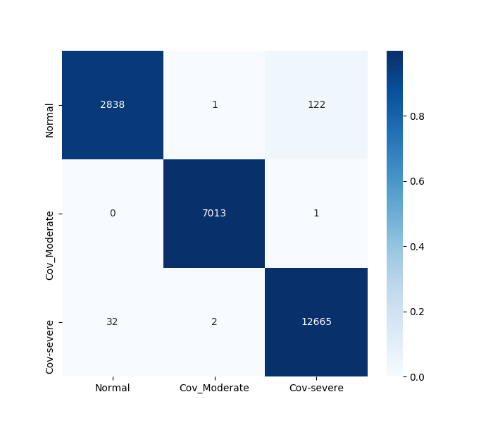
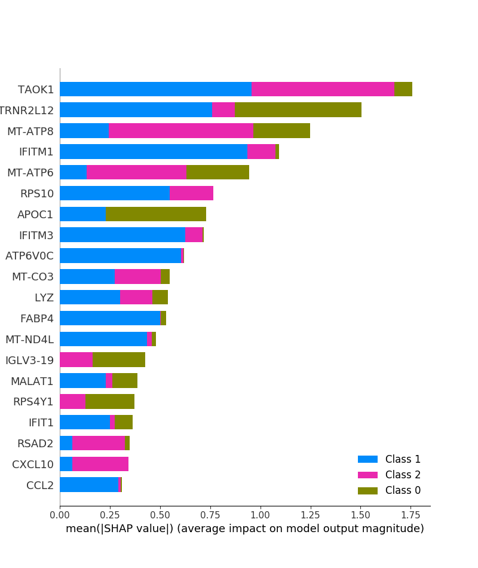

# Machine Learning analysis
 In this section, we present the machine learning analysis of single-cell RNASeq samples for patients with COVID-19.  From the original paper the samples were stratified through 3 levels or clinical responses: normal, covid-19 moderate, and covid-19 severe or critical.
 
# Analysis severe(1) vs moderate(0) response. 

In this section we compared and identify genes that separate the behavior of Severe and moderate patients with COVID-19. We started the analysis from seven files: (server: /media/usb/osbaldo/COVID-19/singlecell/comparison_moderate_severe_covid_19)

    1) Data_filtered.txt (original de single cell).
    2) genes.tsv         (original de single cell).
    3) labels.tsv        (original de single cell).
    From these files we obtain:
    1) cols.csv
    5) medical_class.csv (This file contains the classification of the patients: 0 Normal, 1 COVID-moderate; 2) COVID-19 severe response)
    6) rows.csv
    7) values.csv

    In addition we have these scripts in python:
    1) model.py
    2) load_libraries.py
    3) mlcovid.py
    4) crossvalidation.py


In this situation the number o samples to test are:

|Tables Test |      Phenotype  | Samples |
|------------|:---------------:|--------:|
|            |  severe         |  12699  |
|            |  moderate       |   7014  |


## Step 1

Run in command line the script:

```
> python3 model.py
```
We will obtain the data in a proper notation and these separated in the independent (X) and depende variables (y).
 
## Step 2.

Open a sesion of python and load all the libraries required. In terminal and run:

```
> python3 mlcovid.py
```
 
 # 3 stages classification
 

# XGBoost tree classification.

 Our machine learning analysis start from the count matrix, integrating all the count of genes identified in all the 90,000 unique cells. The main files are:
 1) Data_filtered.txt ( expression matrix as "sparse Matrix")
 2) labels.tsv (label of the samples ordered as indicated in the count matrix).
 3) genes.tsv ( list of genes ordered as the count matrix).
 
Requirements: Install 
```
from scipy import sparse
from numpy import array
import numpy as np
import pandas as pd
from numpy import savetxt 
from sklearn.model_selection import train_test_split
from sklearn.preprocessing import StandardScaler
from sklearn.ensemble import RandomForestClassifier
from sklearn.metrics import confusion_matrix
from sklearn.externals import joblib
print('Libraries Imported')
from sklearn.model_selection import train_test_split
from sklearn.preprocessing import StandardScaler
from sklearn.ensemble import RandomForestClassifier
from sklearn.metrics import confusion_matrix
from sklearn.externals import joblib
print('Libraries Imported')
from scipy import sparse
from numpy import array
from numpy import savetxt 
import pickle
import xgboost as xgb
import matplotlib.pylab as plt
import seaborn as sns
from sklearn.metrics import classification_report, confusion_matrix
from matplotlib import pyplot
import matplotlib
```

Let's star the analysis.

# Files preprocessing.

Given that matrix is written in sparse notation, we separate the varibles to build the normal matrix. In sparse notation the first number into a row is the row of the normal matrix, the second number on the row is the colums; and the third is the numerical values of the entry. We separate and define files to these information. It was done in bash to define these files:
1) rows.csv (File with the rows)
2) cols.csv (File with columns)
3) values.csv (File with the values at row and columns specified in rows.csv and cols.csv files)

```
osbaldo@nautilus:~/COVID-19/singleCell$ sed -n '3,143014366p' Data_filtered.txt | awk '{print$1}' > rows.csv
osbaldo@nautilus:~/COVID-19/singleCell$ sed -n '3,143014366p' Data_filtered.txt | awk '{print$2}' > cols.csv
osbaldo@nautilus:~/COVID-19/singleCell$ sed -n '3,143014366p' Data_filtered.txt | awk '{print$3}' > values.csv
```

We star the analysis with these files:
1) cols.csv  
2) Data_filtered.txt  
3) genes.tsv  
4) labels.tsv  
5) medical_class.csv  (This file contains the classification of the patients: 0 Normal, 1 COVID-moderate; 2) COVID-19 severe or response)
6) rows.csv  
7) values.csv


Run this script in python to buld the model for machine learinig analysis 
```
python3 model.py
```
The genrated files are located in the folders: 
1) /dat/  (contain the X and y picled)
2) /Splited_data/ (contain X_test.pickle  X_train.pickle  y_test.pickle  y_train.pickle)

The next step is to construct the model and proceed with the XGBoost analysis. To this end, we load all the variable in python3: X_train, X_test, y_train, y_test, model, X, y, D_train, D_test. Thus, we open a sesion and run this script. In or server these files are located here: /media/usb/osbaldo/COVID-19/singlecell/repeate

```
import xgb_os
X_train, X_test, y_train, y_test, model, X, y, D_train, D_test, model = xgb_os.preparation()
```

Once we have all the files we proceed to calculate the confuse matrix. Thus we open python3 and run

```
python3

import os
import shap

pred= model.predict(D_test)
print(classification_report(y_test, pred))
cm = confusion_matrix(y_test, pred)
cm

```

The confuse matrix can be represented grafically by defining this function in python 

```

def plot_confusion_matrix(cm, classes, normalized=True, cmap='bone'):
    plt.figure(figsize=[7, 6])
    norm_cm = cm
    if normalized:
        norm_cm = cm.astype('float') / cm.sum(axis=1)[:, np.newaxis]
        sns.heatmap(norm_cm, annot=cm, fmt='g', xticklabels=classes, yticklabels=classes, cmap=cmap)
```
Then we run and save the figure in a new folder called figures/ : 
```
import os
os.system('mkdir figures')
plot_confusion_matrix(cm, ['Normal', 'Cov_Moderate', 'Cov-severe'])
pyplot.savefig('figures/confusematrix.png')
```


## Explaning analysis

In this setion we explore the set of genes that played a significant role in differentiate the samples at any level (normal, moderate and severe COVID-19). The first plot render the genes that have more contribution to separate the samples. 
```
import os
import pickle
import shap

```
Lets start th SHAP analysis
```
import os
# SHAP analysis
explainer = shap.TreeExplainer(model)
shap_values = explainer.shap_values(X)
os.system('mkdir pickle')
# Save shap_values in pickle
pickle.dump(shap_values, open("pickle/shap_values.pickle", 'wb'), protocol=4);

#load shap_values. This will allow to load the shao_values file withour run again the code.
import os
os.system('mkdir pickle')
pickle_in = open("pickle/shap_values.pickle","rb")
shap_values = pickle.load(pickle_in);
```
Finally we recap and save the figure

```

shap.summary_plot(shap_values, X)
pyplot.savefig('figures/shap_summary1.png')
```
In figure below we identify those genes with highest relevance in classify the patients as normal (0), moderate (1), and severe (2) COVID-19 phenotype. As Figure shows, genes have different degree of contribution in most of the subgroups. Besides, only a few genes have a specific contitribution in some groups. 




To have a more detail description of the role of important genes into the clasification, we procedded to analyze the profile behavior at each classitication for each important gene shown in the previous plot.  

```
##### SUMMANRY PLOTS
import matplotlib.pyplot as plt
for i in range(3):
    pl.clf()
    shap.summary_plot(shap_values[i], X)
    plt.savefig('sum_' + str(i)+ '.png', format='png', dpi=300, bbox_inches='tight')

```
For instance, in the case of the classification for patients with COVID-19 severe, the gene expression profile of the genes are given below:


## Dependence plot

The last part of this analysis is focused to identify association between variables. We depicted these plots, called dependence plots, for main variables involved in classification. Below, we show one of this figures, but the entire set are stored in folder Dependence_figures.  
To obtain the dependence plots: 

```
## Figures
## We have selected those genes with importance in the classification.
lista = [12962,20721,24024,16163,16164,4903,25601,25602,8242,24024,12964,19123,25603,11543,25605,24762,13668,24587,2576,6044,20797]

os.chdir('figures')
for name in X_train.columns[lista]:
    shap.dependence_plot(name, shap_values[0], X, display_features=X_display)
    plt.savefig(str(name) + '.png', format='png', dpi=300, bbox_inches='tight')
```


