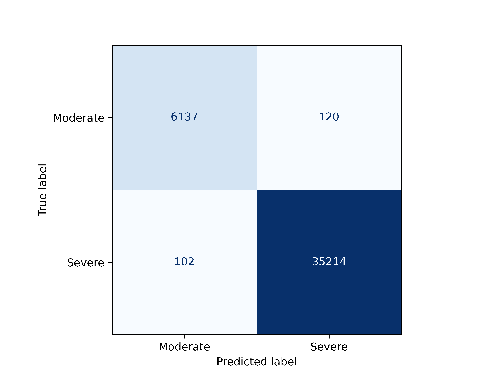

# XGBoost Model
 This section contains the XGBoost model that allows us to predict and classify the cell category into moderate (0) or severe (1) clinical response from their scRNASeq profiles. In the following table we described the files   

|File |      Description  | 
|-----|:---------------:|
|model.pickle| XGBoost model used for the paper, it incluing all the genes.          |
|  CompleteModel_confusionMatrix.py  | Code for reconstruct the model with all the genes from scRNAseq        |    
| X_test & y_test    | Count matrix and cell classification to test the model        |  
| X_val_y_val.zip    | Count matrix and cell classification to validate the model. Data were independen on training and was obtained from [here](https://www.cell.com/cell/fulltext/S0092-8674(21)00148-3?_returnURL=https%3A%2F%2Flinkinghub.elsevier.com%2Fretrieve%2Fpii%2FS0092867421001483%3Fshowall%3Dtrue)| 
|cm_cm_val.zip     | Compressed file with the confusion matrices evaluating the test(cm) and validation(cm_val) dataset respectively.        |  
| Fig2.py    | Script to generate the Figure 2 in main paper.        |  

 
## Loading the model 

To construct the XGBoostmodel and prepare it to evaluate the dataset used in the main paper, run in command line the script:

```
> python3 CompleteModel_confusionMatrix.py
```
As a result, the user will generate these plots:

|Test data |      Validation data  | 
|-----|:---------------:|
| | :|

The variable model can be used to evaluate different datasets defined for the user. If this is the case, take carufull that the set of genes en the new dataset of validation has the same length and with the same order as defined in the original X dataframe. 

# Figure 2 main paper


 
